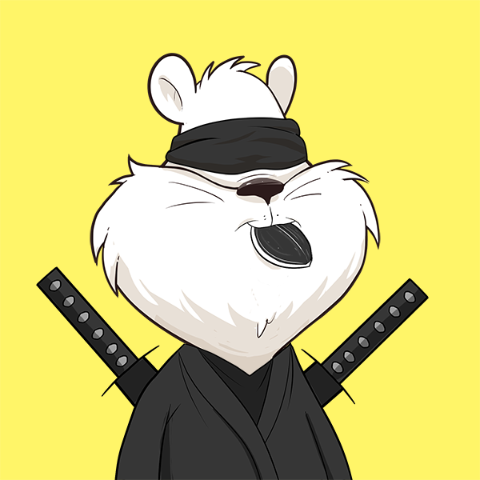
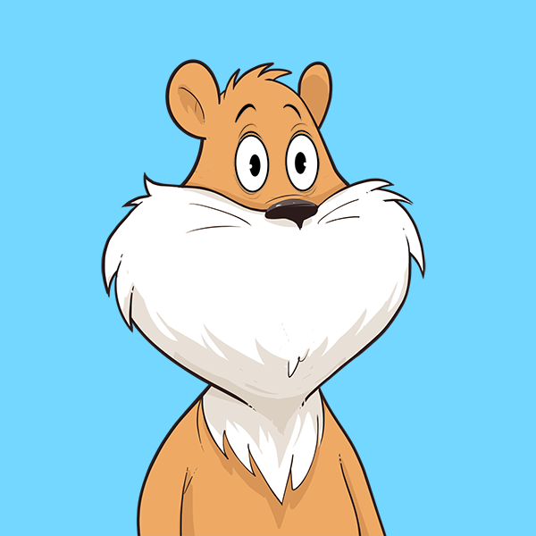

# **Chamsters NFT on Chia Blockchain Project**
## **What is the Chamster NFT Project?**
- Chia + Hamsters = Chamsters
- Chamsters are PFP art collection of hamsters living on the Chia Blockchain.
- Each Chamster carries a set of traits that are algorithmically generated 
- Traits do come in differnet rarity levels; Common, Rare, Epic, Legendary
- Its up to you to trade / mint for the rarity you want or the character you like
- Chamsters Holders are granted access to a private channel on our Discord where activities, voting, and perks will become available    
- A presale for the first round will be in the form of Chia Asset Tokens (CAT); Chamster Tokens will be exchangeable for a Chamster NFT 
- This round will have limited supplies as it is the Founder's Series 

## **Chamster Supply** 
- A limited supply of 300 Chamstsers will be available 
- 30 of the 270 Chamsters are Legendary with several 1/1 traits
- The remaining 270 Chamsters are ranked based on the rarity of all its traits   

## **Sample of Legendary Chamsters**

## **Samples of Traits**

### Eyes:

Common

Rare

Epic

### Mouth:
Common

Rare

Epic

### Hats:

Rare

Epic

### Clothes:
Common

Rare

Epic

# **Development Stages**

## **Chamster Tokens**
- The presale of 300 Chamster tokens (CHM) will be available on the Chia decentralized exchange Offerbin.io (https://offerbin.io)
- Only 200 Tokens will be issued for this Founder's Series.
- The price will be 1 XCH per CHM Tokens
- CHM Tokens will be used to mint Chamster NFTs
- Chamster Tokens holders will be grated access to a private channel on our Discord for Pre-Mint discussions and Q&A on the project

## **Development**
- Owners will be able to customize the royalty reward address  
- Rarity chart of all Chamsters will be available on the website after all Chamsters have been minted  
- A Private channel for Chamster Holders will be opened to participate in weekly games and activities with rewards 
- CHM Tokens will rewareded for winning weekly activities    
