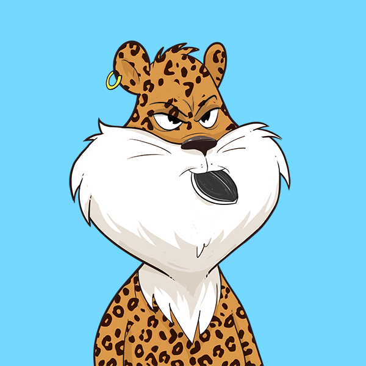
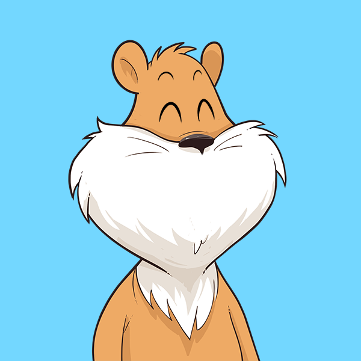

# **Chamsters**

## **Background**
- Hamsters on a quest to finding sunflower seeds & Chia Tokens. 
- Chia + Hamsters = Chamsters.
- Chamsters is a combination of PFP artwork collection and a Chia Farming Club on the Chia Blockchain.
- Each Chamster carries a set of traits that are algorithmically generated.
- Only Legendary Chamsters are custom made. 
- Traits come in differnet rarity levels; Common, Rare, Epic, and Legendary.

## **Chamster Chia Farming Club**
- Chamsters NFT project will use funds to develop its own farm rewarding Chamster owners with XCH rewards.
- We aim to help support the Chia Blockchain and its ecosystem as well as enabling new users to partake in farming rewards.
- Check out Discord Channel for more information on the reward system. 

## **Founder's Chamster Series**
- Release date of the Chamter NFT will be annoucned after Chia's releases NFT1 Standard.  
- A total of 200 Chamster NFT will be available for mint late June'22.
- 30 of the 200 Chamsters are Legendary with several 1/1 traits.
- The remaining 170 Chamsters are ranked based on the combination of rarity level on all its traits.
- Founder's Series will develop the foundation of 800 TB Chamster's Chia Farm.
- Funds will be set aside for further project utility development.     

## **Chamster Tokens**
- A presale for the first round will be in the form of Chia Asset Tokens (CAT); Chamster Tokens will be exchangeable for a Chamster NFT 
- This round will have limited supply of 200 Tokens, used specifically for the founders NFT only. 
- The presale of 200 Chamster tokens (CHM) will be available in the form of Chia Offer files
- The price will be 3 XCH per CHM Tokens
- CHM Token holders will be granted early access to Chamster private Discord channel for Pre-Mint discussions and Q&A on the project
- Asset ID (Coin ID): 760de79f6d5a978feff1b81035c0720b26cde4254f330cf47fd8705425bf0dd7
- Asset Name (Coin Name): Chamster Token
- Asset Abbreviation: CHM

## **CHM Offer Files**
- Offer files of CHM will be availbale on [Dexie]

## **For more information, join our Discord Channel:** [Chamster Discord Channel]

## **Sample of Legendary Chamsters**

## **Samples of Somes Traits**

### Eyes:

Common

Rare

Epic

### Mouth:
Common

Rare

Epic

### Hats:

Rare

Epic

### Clothes:
Common

Rare

Epic

## Channels
- Discord:  http://discord.gg/dBpchMFmzn
- Twitter: https://twitter.com/chamster_chia 

## **FAQs**

[Chamster Discord Channel]: https://discord.gg/Fz6fDhK3t9
[Hash Green]: https://hash.green/
[Dexie]: https://dexie.space/](https://dexie.space/offers/760de79f6d5a978feff1b81035c0720b26cde4254f330cf47fd8705425bf0dd7/xch
[Offerbin]: https://offerbin.io/
[Offerpool]: https://offerpool.io/

